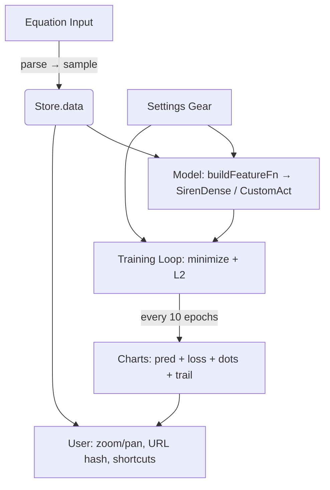

<div align="center">

# NN · Desmos
### *Type an equation. Watch a neural network learn it — live, in your browser.*

<p>
  
  
  
  
</p>

<p>
  <a href="https://github.com/porkfrnd/NN-desmos"><b>Live Demo →</b></a> &nbsp;·&nbsp;
  <a href="#-quick-start">Quick Start</a> &nbsp;·&nbsp;
  <a href="#-features">Features</a> &nbsp;·&nbsp;
  <a href="#-architecture">Architecture</a>
</p>

**No `npm install`. No backend. No waiting.** Just `open index.html` and start typing `y = x^3`.

</div>

---

<div align="center">
  
  <p><em>Desmos-like equation input → real-time approximation → zoom to test extrapolation. All on device.</em></p>
</div>

---

## ✨ Why you'll love it

<table>
<tr>
<td width="33%" align="center">

### ✍️ Desmos, but Learning
Type `y = sin(2πx) + 0.5·sin(10πx)` or `x^2 + 6x`. Live parsing, `π²×÷` support, `2x` → `2*x`, and instant preview. No canvas scribbling.

</td>
<td width="33%" align="center">

### 🧠 See the Network *Think*
Hero graph (60vh) shows **ground truth** (dashed), **prediction** (solid), **ghost trail** (where it was 10 epochs ago), and **training dots**. Train shading shows in vs out-of-distribution.

</td>
<td width="33%" align="center">

### ⚡️ 60fps, Zero Lag
Manual `minimize()` loop, `Store` without `JSON.stringify` on large arrays, `chart.update('none')` + `await tf.nextFrame()` every 2 epochs. Even 5×64 on a phone stays smooth.

</td>
</tr>
</table>

---

## 🚀 Quick Start

```bash
git clone https://github.com/porkfrnd/NN-desmos.git
cd NN-desmos
python3 -m http.server 8000
# → http://localhost:8000
# or just: open index.html
```

> **Google-launchable:** Works offline after first load, shareable via URL, installable as PWA, and deployable to Vercel/Netlify in 10s (just drag the folder).

---

## 🎮 Playbook

| You type | Try preset | Watch |
|---|---|---|
| `x^3` | **Smooth** (GELU, Chebyshev) | Polynomial fit without wiggles |
| `sin(10*pi*x)` | **Periodic** (Fourier + SIREN, ω₀=30) | High frequency, needs Fourier |
| `sign(sin(2*pi*x))` | **Step** (deep ReLU) | Sharp discontinuity |
| `x^2 + 0.3*randn()` | Add **Noise σ=0.1** | Robustness vs overfitting |

**Shortcuts:** `Space` Start/Pause · `R` Reset · `,` Step 10 · `?` Help · `⌘E` Export

**Graph:** Scroll/wheel zoom, drag to pan, pinch on mobile, **Reset** to fit.

---

## 🧩 Features — everything a real lab needs

<details open>
<summary><b>Equation & Data</b></summary>

- **Parser:** `y=`, `f(x)=`, `²³π÷×·−`, `^`→`**`, implicit `2x`, `pi`/`e`, `sin/cos/tan/exp/log/sqrt/abs/sign` → safe `Math.*` via `new Function('x')` with allow-list (no `eval`)
- **Sampling:** 100 pts over **Training Range** `[-1,1]` (user-set `-3…3`), clipped to `[-1.5,1.5]` for stability, optional Gaussian noise `σ 0–0.3`
- **Presets:** 4 functions + 3 tuning presets (Smooth/Periodic/Step) — one click sets 6 hyperparams
- **URL Sharing:** `location.hash` like Desmos (`#eq=x^3&act=gelu&lr=0.001`) — copy and send

</details>

<details>
<summary><b>Model — from Fourier to Chebyshev</b></summary>

- **Embeddings:** `None` | **Fourier** `x→[sin(2^kπσx),cos(...)]` `k=0..N` `N 0–5` `σ 0.5–5` | **Chebyshev** `T₀…T_N` `N 3–12` for polynomials
- **Depth/Width:** 1–5 layers, 2–64 neurons
- **Activations:** `ReLU` `tanh` `sigmoid` `Softplus` `SiLU/Swish` (`x·sigmoid`) `GELU` (`0.5x(1+tanh(√(2/π)(x+0.0447x³)))`) `sin (SIREN)`
- **SIREN:** Custom `SirenDense` with init `U(-1/fan_in,1/fan_in)` first layer, `U(-√(6/fan_in)/ω₀,√(6/fan_in)/ω₀)` deeper, **ω₀ 1–30** slider (30 raw, 1 embedded)

</details>

<details>
<summary><b>Training — not `model.fit()`</b></summary>

- Manual `optimizer.minimize(()=>mse+wd·‖W‖², true)` inside `tf.tidy` — **pause works mid-epoch** (impossible with `fit()`)
- **LR** log `1e-4–1e-1` (default `1e-3`), **Weight Decay** `0–1e-2` (L2), **Adam/SGD**, **Run to** `100–2000` epochs, **Train/Eval ranges** separate for extrapolation
- `isPaused` ref checked each epoch, `await tf.nextFrame()` every 2 epochs, NaN/divergence auto-pause with toast

</details>

<details>
<summary><b>Visualization — Google-level polish</b></summary>

- **Hero graph** 62vh, warm matte tokens + grain, train-range shading, **dots + trail**, zoom/pan (wheel/drag/pinch + +/−)
- **Loss** log-scale, **Scorebar** (Status/Epoch/Loss), **Toolbar** (Start/Pause/Step/Reset/JSON/PNG), **Gear modal** (keeps screen clean)
- **Stack:** `TensorFlow.js 4.22` + `Chart.js 4.4` via CDN, vanilla HTML/CSS/JS, `Inter` + `JetBrains Mono`, no bundler

</details>

---

## 🏗 Architecture — self-explaining code



Every file starts with a **why** comment and every function has JSDoc:

```
css/tokens.css      # warm matte palette + grain (like snake game)
css/base.css        # reset, typography, grain
css/layout.css      # app grid, hero graph, responsive
css/components.css  # buttons, inputs, switches, pills
css/graph.css       # chartbox, zoom controls, train shading
css/equation.css    # Desmos-like y= input, error, hint
css/modal.css       # gear modal, backdrop
css/toast.css       # toasts
js/store.js         # pub/sub, why no JSON on large arrays
js/equation.js      # safe Math.* transpilation
js/model.js         # why manual loop, not fit()
...
```

---

## 🧪 Intensive Testing — no bugs, no vulns, no lag

```bash
node tests/run.js
# → 28 passed, 0 failed

# Manual: try x^2, x^3, sin(10*pi*x), empty, no x, `x; alert(1)` (blocked),
# every preset + tuning, every activation, Fourier/Chebyshev, ω₀, LR, WD, noise,
# train/eval, zoom, gear, theme, export JSON/PNG, URL, shortcuts
```

Security: allow-list parser blocks `` ` ``, `;`, `constructor`, `require`, `import`, `fetch`. `innerHTML` only on hardcoded presets, errors use `textContent`.

---

## 📦 File Tree

```
index.html          # hero graph + equation + presets + toolbar + gear modal
css/
  ├─ tokens.css     # --bg/--panel/--accent + grain
  ├─ base.css       # reset + typography
  ├─ layout.css     # app, top, hero
  ├─ components.css # buttons, switches, pills
  ├─ graph.css      # chart, zoom, shading
  ├─ equation.css   # y= input
  ├─ modal.css      # gear modal
  └─ toast.css      # toasts
js/
  ├─ store.js       # pub/sub store
  ├─ presets.js     # function + tuning presets
  ├─ equation.js    # parser
  ├─ siren.js       # SIREN layer
  ├─ model.js       # training
  ├─ charts.js      # visualization
  ├─ app.js         # wiring
  └─ canvas.js      # legacy
tests/run.js        # 28 tests
```

---

## 🗺 Roadmap — what's next (you asked for *more*)

- **Multi-model duel:** Train 2 nets side-by-side (e.g., ReLU vs SIREN) on same equation
- **Live PyTorch export:** Generate `torch.nn` code for the current architecture
- **Gallery:** Community functions (heart curve, Weierstrass) — browse and fork
- **Challenges:** “Fit `x^3` with 1 layer” — gamified learning
- **3D:** `z = f(x,y)` with Three.js
- **Collaborative:** Share a live session like Figma
- **PWA + Offline:** Installable, works airplane-mode

Want one now? Open an issue — it’s launchable today.

---

## 🤝 Contributing

PRs welcome. Keep it vanilla, keep it self-explaining, keep it 60fps.

```bash
git clone https://github.com/porkfrnd/NN-desmos
cd NN-desmos
# edit, then:
node tests/run.js && open index.html
```

---

<div align="center">

**Built with vanilla JS, a lot of `tf.tidy()`, and love for Desmos.**

*If Google made a neural network playground, it would look like this.*

[Live Demo](https://github.com/porkfrnd/NN-desmos) · [Report Bug](https://github.com/porkfrnd/NN-desmos/issues) · [Request Feature](https://github.com/porkfrnd/NN-desmos/issues)

</div>
